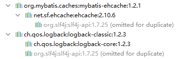
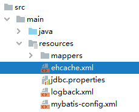
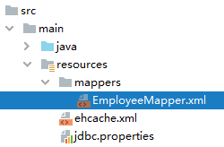
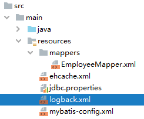

[[toc]]

# 第四节 整合EHCache

## 1、EHCache简介

官网地址：https://www.ehcache.org/


> Ehcache is an open source, standards-based cache that boosts performance, offloads your database, and simplifies scalability. <span style="color:blue;font-weight:bold;">It's the most widely-used Java-based cache because it's robust, proven, full-featured, and integrates with other popular libraries and frameworks</span>. Ehcache scales from in-process caching, all the way to mixed in-process/out-of-process deployments with terabyte-sized caches.


## 2、整合操作

### ①Mybatis环境

在Mybatis环境下整合EHCache，<span style="color:blue;font-weight:bold;">前提</span>当然是要先准备好<span style="color:blue;font-weight:bold;">Mybatis的环境</span>。


### ②添加依赖

#### [1]依赖信息

```xml
<!-- Mybatis EHCache整合包 -->
<dependency>
    <groupId>org.mybatis.caches</groupId>
    <artifactId>mybatis-ehcache</artifactId>
    <version>1.2.1</version>
</dependency>
<!-- slf4j日志门面的一个具体实现 -->
<dependency>
    <groupId>ch.qos.logback</groupId>
    <artifactId>logback-classic</artifactId>
    <version>1.2.3</version>
</dependency>
```


#### [2]依赖传递情况




#### [3]各主要jar包作用

| jar包名称       | 作用                            |
| --------------- | ------------------------------- |
| mybatis-ehcache | Mybatis和EHCache的整合包        |
| ehcache         | EHCache核心包                   |
| slf4j-api       | SLF4J日志门面包                 |
| logback-classic | 支持SLF4J门面接口的一个具体实现 |


### ③整合EHCache

#### [1]创建EHCache配置文件

ehcache.xml




#### [2]文件内容

```xml
<?xml version="1.0" encoding="utf-8" ?>
<ehcache xmlns:xsi="http://www.w3.org/2001/XMLSchema-instance"
         xsi:noNamespaceSchemaLocation="../config/ehcache.xsd">
    <!-- 磁盘保存路径 -->
    <diskStore path="D:\atguigu\ehcache"/>
    
    <defaultCache
            maxElementsInMemory="1000"
            maxElementsOnDisk="10000000"
            eternal="false"
            overflowToDisk="true"
            timeToIdleSeconds="120"
            timeToLiveSeconds="120"
            diskExpiryThreadIntervalSeconds="120"
            memoryStoreEvictionPolicy="LRU">
    </defaultCache>
</ehcache>
```

> 引入第三方框架或工具时，配置文件的文件名可以自定义吗？
>
> - 可以自定义：文件名是由我告诉其他环境
> - 不能自定义：文件名是框架内置的、约定好的，就不能自定义，以避免框架无法加载这个文件


#### [3]指定缓存管理器的具体类型

还是到查询操作所的Mapper配置文件中，找到之前设置的cache标签：



```xml
<cache type="org.mybatis.caches.ehcache.EhcacheCache"/>
```


### ④加入logback日志

存在SLF4J时，作为简易日志的log4j将失效，此时我们需要借助SLF4J的具体实现logback来打印日志。


#### [1]各种Java日志框架简介

门面：

| 名称                                                         | 说明             |
| ------------------------------------------------------------ | ---------------- |
| JCL（Jakarta Commons Logging）                               | 陈旧             |
| SLF4J（Simple Logging Facade for Java）<span style="color:blue;">★</span> | 适合             |
| jboss-logging                                                | 特殊专业领域使用 |


实现：

| 名称                                      | 说明                                               |
| ----------------------------------------- | -------------------------------------------------- |
| log4j<span style="color:blue;">★</span>   | 最初版                                             |
| JUL（java.util.logging）                  | JDK自带                                            |
| log4j2                                    | Apache收购log4j后全面重构，内部实现和log4j完全不同 |
| logback<span style="color:blue;">★</span> | 优雅、强大                                         |

注：标记<span style="color:blue;">★</span>的技术是同一作者。


#### [2]logback配置文件



```xml
<?xml version="1.0" encoding="UTF-8"?>
<configuration debug="true">
	<!-- 指定日志输出的位置 -->
	<appender name="STDOUT"
		class="ch.qos.logback.core.ConsoleAppender">
		<encoder>
			<!-- 日志输出的格式 -->
			<!-- 按照顺序分别是：时间、日志级别、线程名称、打印日志的类、日志主体内容、换行 -->
			<pattern>[%d{HH:mm:ss.SSS}] [%-5level] [%thread] [%logger] [%msg]%n</pattern>
		</encoder>
	</appender>
	
	<!-- 设置全局日志级别。日志级别按顺序分别是：DEBUG、INFO、WARN、ERROR -->
	<!-- 指定任何一个日志级别都只打印当前级别和后面级别的日志。 -->
	<root level="DEBUG">
		<!-- 指定打印日志的appender，这里通过“STDOUT”引用了前面配置的appender -->
		<appender-ref ref="STDOUT" />
	</root>
    
	<!-- 根据特殊需求指定局部日志级别 -->
	<logger name="com.atguigu.crowd.mapper" level="DEBUG"/>
	
</configuration>
```


### ⑤junit测试

正常按照二级缓存的方式测试即可。因为整合EHCache后，其实就是使用EHCache代替了Mybatis自带的二级缓存。


### ⑥EHCache配置文件说明

当借助CacheManager.add("缓存名称")创建Cache时，EhCache便会采用&lt;defalutCache/&gt;指定的的管理策略。

defaultCache标签各属性说明：

| 属性名                          | 是否必须 | 作用                                                         |
| ------------------------------- | -------- | ------------------------------------------------------------ |
| maxElementsInMemory             | 是       | 在内存中缓存的element的最大数目                              |
| maxElementsOnDisk               | 是       | 在磁盘上缓存的element的最大数目，若是0表示无穷大             |
| eternal                         | 是       | 设定缓存的elements是否永远不过期。<br />如果为true，则缓存的数据始终有效，<br />如果为false那么还要根据timeToIdleSeconds、timeToLiveSeconds判断 |
| overflowToDisk                  | 是       | 设定当内存缓存溢出的时候是否将过期的element缓存到磁盘上      |
| timeToIdleSeconds               | 否       | 当缓存在EhCache中的数据前后两次访问的时间超过timeToIdleSeconds的属性取值时，<br />这些数据便会删除，默认值是0,也就是可闲置时间无穷大 |
| timeToLiveSeconds               | 否       | 缓存element的有效生命期，默认是0.,也就是element存活时间无穷大 |
| diskSpoolBufferSizeMB           | 否       | DiskStore(磁盘缓存)的缓存区大小。默认是30MB。每个Cache都应该有自己的一个缓冲区 |
| diskPersistent                  | 否       | 在VM重启的时候是否启用磁盘保存EhCache中的数据，默认是false。 |
| diskExpiryThreadIntervalSeconds | 否       | 磁盘缓存的清理线程运行间隔，默认是120秒。每个120s，<br />相应的线程会进行一次EhCache中数据的清理工作 |
| memoryStoreEvictionPolicy       | 否       | 当内存缓存达到最大，有新的element加入的时候， 移除缓存中element的策略。<br />默认是LRU（最近最少使用），可选的有LFU（最不常使用）和FIFO（先进先出） |


[上一节](verse03.html) [回目录](index.html) [下一节](verse05.html)