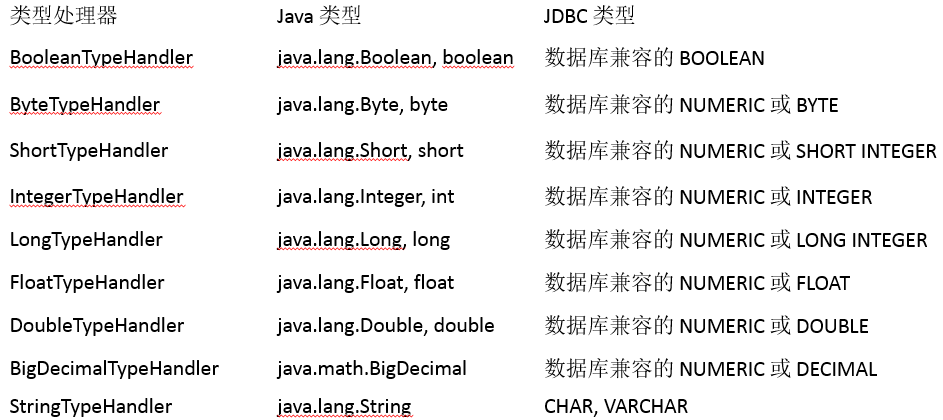
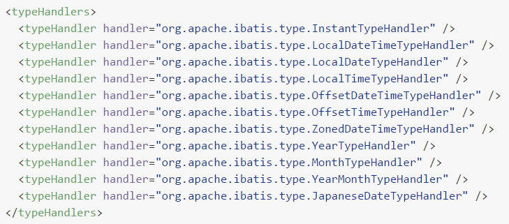

[[toc]]


# 第二节 类型处理器

## 1、Mybatis内置类型处理器

无论是 MyBatis 在预处理语句（PreparedStatement）中设置一个参数时，还是从结果集中取出一个值时，都会用类型处理器将获取的值以合适的方式转换成 Java 类型。


Mybatis提供的内置类型处理器：




## 2、日期时间处理

日期和时间的处理，JDK1.8以前一直是个头疼的问题。我们通常使用 JSR310 规范领导者 Stephen Colebourne 创建的 Joda-Time 来操作。JDK1.8已经实现全部的JSR310 规范了。

Mybatis在日期时间处理的问题上，提供了基于 JSR310（Date and Time API）编写的各种日期时间类型处理器。

MyBatis3.4以前的版本需要我们手动注册这些处理器，以后的版本都是自动注册的。

如需注册，需要下载mybatistypehandlers-jsr310，并通过如下方式注册




## 3、自定义类型处理器

当某个具体类型Mybatis靠内置的类型处理器无法识别时，可以使用Mybatis提供的自定义类型处理器机制。

- 第一步：实现 org.apache.ibatis.type.TypeHandler 接口或者继承 org.apache.ibatis.type.BaseTypeHandler 类。
- 第二步：指定其映射某个JDBC类型（可选操作）。
- 第三步：在Mybatis全局配置文件中注册。


### ①创建自定义类型转换器类

```java
@MappedTypes(value = Address.class)
@MappedJdbcTypes(JdbcType.CHAR)
public class AddressTypeHandler extends BaseTypeHandler<Address> {
    @Override
    public void setNonNullParameter(PreparedStatement preparedStatement, int i, Address address, JdbcType jdbcType) throws SQLException {

    }

    @Override
    public Address getNullableResult(ResultSet resultSet, String columnName) throws SQLException {

        // 1.从结果集中获取原始的地址数据
        String addressOriginalValue = resultSet.getString(columnName);

        // 2.判断原始数据是否有效
        if (addressOriginalValue == null || "".equals(addressOriginalValue))
            return null;

        // 3.如果原始数据有效则执行拆分
        String[] split = addressOriginalValue.split(",");
        String province = split[0];
        String city = split[1];
        String street = split[2];

        // 4.创建Address对象
        Address address = new Address();
        address.setCity(city);
        address.setProvince(province);
        address.setStreet(street);

        return address;
    }

    @Override
    public Address getNullableResult(ResultSet resultSet, int i) throws SQLException {
        return null;
    }

    @Override
    public Address getNullableResult(CallableStatement callableStatement, int i) throws SQLException {
        return null;
    }
}
```


### ②注册自定义类型转换器

在Mybatis全局配置文件中配置：

```xml
<!-- 注册自定义类型转换器 -->
<typeHandlers>
    <typeHandler 
                 jdbcType="CHAR" 
                 javaType="com.atguigu.mybatis.entity.Address" 
                 handler="com.atguigu.mybatis.type.handler.AddressTypeHandler"/>
</typeHandlers>
```


[上一节](verse01.html) [回目录](index.html) [下一节](verse03.html)