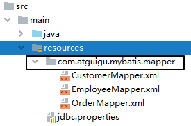

[[toc]]

# 第三节 Mapper映射

Mybatis允许在指定Mapper映射文件时，只指定其所在的包：

```xml
<mappers>
		<package name="com.atguigu.mybatis.dao"/>
</mappers>
```


此时这个包下的所有Mapper配置文件将被自动加载、注册，比较方便。


但是，要求是：

- Mapper接口和Mapper配置文件名称一致
- Mapper配置文件放在Mapper接口所在的包内


如果工程是Maven工程，那么Mapper配置文件还是要放在resources目录下：




[上一节](verse02.html) [回目录](index.html) [下一节](verse04.html)