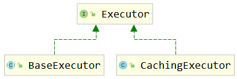
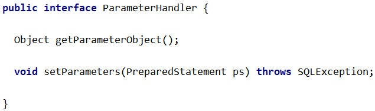
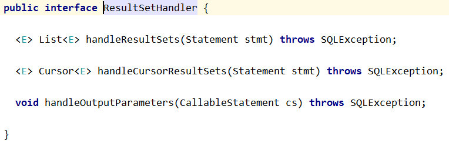
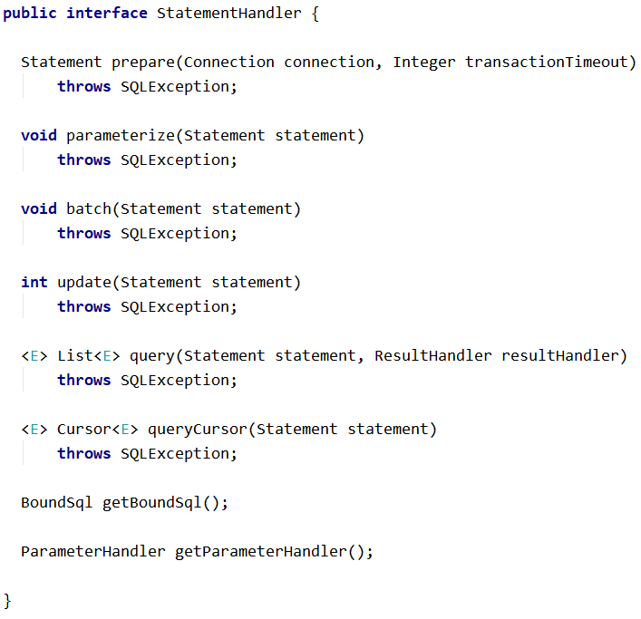
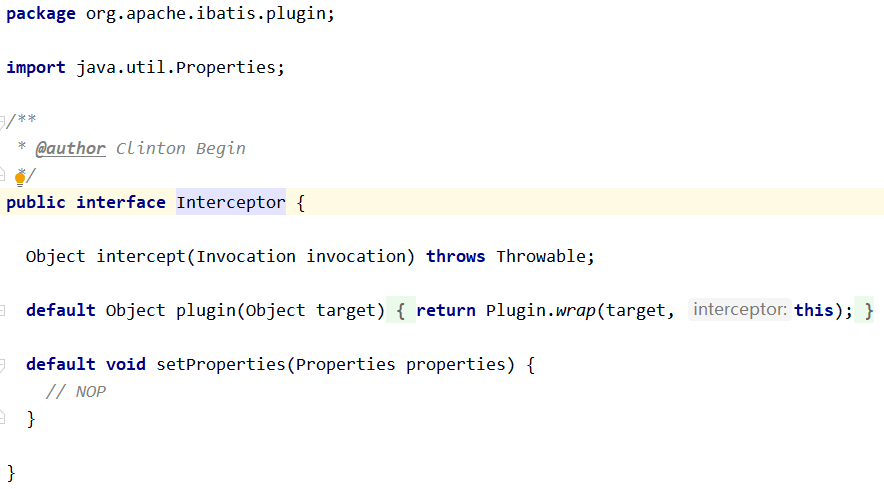

[[toc]]

# 第四节 插件机制

## 1、Mybatis四大对象

### ①Executor

### ②ParameterHandler

### ③ResultSetHandler

### ④StatementHandler

## 2、Mybatis插件机制

插件是MyBatis提供的一个非常强大的机制，我们可以通过插件来修改MyBatis的一些核心行为。插件通过动态代理机制，可以介入四大对象的任何一个方法的执行。著名的Mybatis插件包括 PageHelper（分页插件）、通用 Mapper（SQL生成插件）等。

如果想编写自己的Mybatis插件可以通过实现org.apache.ibatis.plugin.Interceptor接口来完成，表示对Mybatis常规操作进行拦截，加入自定义逻辑。

但是由于插件涉及到Mybatis底层工作机制，在没有足够把握时不要轻易尝试。

[上一节](verse03.html) [回目录](index.html) [下一节](verse05.html)