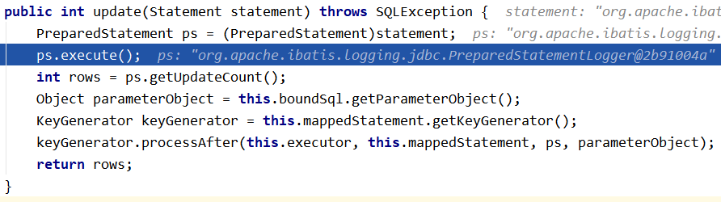
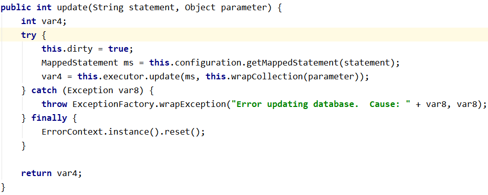

[[toc]]

# 第五节 Mybatis底层的JDBC封装

org.apache.ibatis.executor.statement.PreparedStatementHandler类：

查找上面目标时，Debug查看源码的切入点是：

org.apache.ibatis.session.defaults.DefaultSqlSession类的update()方法

[上一节](verse04.html) [回目录](index.html) [下一节](verse06.html)